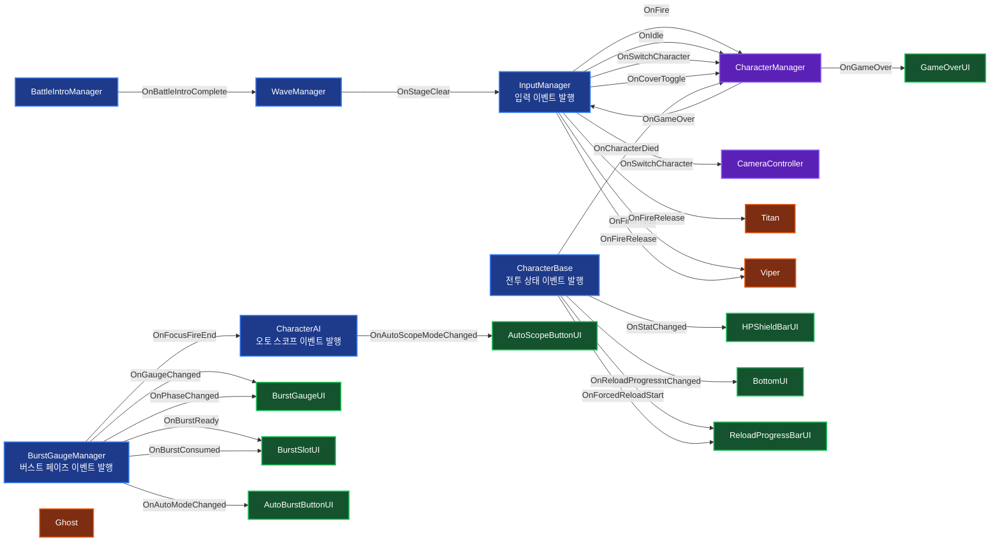

# Project BUSTER — NIKKE Combat System Reconstruction

> 시프트업의 건슈팅 RPG **Goddess of Victory: NIKKE** 의 전투 구조를 분석하고,
> 핵심 시스템을 직접 재설계·재구현한 1인 개발 포트폴리오 프로젝트.

---

## 1. 프로젝트 개요

| 항목 | 내용 |
|---|---|
| 프로젝트명 | Project BUSTER |
| 장르 | Mobile TPS / Cover Shooter (NIKKE-Like) |
| 개발 인원 | 1인 |
| 개발 기간 | 약 3개월 |
| 엔진 | Unity (URP) |
| 언어 | C# |
| 대상 플랫폼 | PC (Mobile 입력 추상화 구조 유지) |
| 개발 목적 | 상용 게임 전투 시스템의 분석·재구현을 통한 클라이언트 아키텍처 역량 증명 |

본 프로젝트는 "게임을 통째로 따라 만드는 것"이 아니라
**원작의 전투 메커닉을 분해·재해석·재구현**하는 데 초점을 두었습니다.

핵심 설계 축:

- State Machine 기반 캐릭터/적 전투 흐름
- Event-Driven 입력 추상화 (`InputManager` → 정적 이벤트)
- ObjectPool + IPoolable 인터페이스로 GC 최소화
- 추상 클래스 `CharacterBase` / `EnemyBase` 상속 구조
- Strategy 패턴 기반 적 타겟팅 (`ITargetStrategy`)
- 캐릭터 스위칭에 연동되는 카메라 Lerp 연출

---

## 2. 원작(NIKKE) 메커닉 재현 매트릭스

| 원작 메커닉 | 본 프로젝트 구현 | 일치도 |
|---|---|---|
| 엄폐 상태에서는 쉴드, 노출 상태에서는 HP가 깎임 | `CharacterBase.TakeDamage()` 가 `CharacterState`(Idle/Fire/Reload) 로 분기 | ★★★★★ |
| 1→2→3 버스트 단계 강제 + Full Burst | `BurstGaugeManager` 의 `BurstPhase` (Charging → Step1/2/3Ready → FocusFire) | ★★★★★ |
| 20초 안에 사용 안 하면 단계 리셋 | `StepReadyCoroutine(duration)` + `ResetToCharging()` | ★★★★★ |
| Full Burst 15초 지속 | `FocusFireCoroutine` (`focusFireDuration = 15f`) | ★★★★★ |
| 버스트 컷씬 동안 시간 정지 | `BurstSequence` 에서 `Time.timeScale = 0f` ↔ 1f 전환 | ★★★★☆ |
| 오토 버스트 (Auto) | Tab 키 `ToggleAutoMode()` + `AutoBurstCoroutine` (0.7초 후 자동 발동) | ★★★★★ |
| 오토 조준 (Auto Scope) | LeftShift 키 `CharacterAI.ToggleAutoScopeMode()` | ★★★★☆ |
| 캐릭터 무기별 발사 거동 (AR/MG/SR) | `Ghost` / `Titan` / `Viper` 각 무기별 `TryFire` 오버라이드 | ★★★★★ |
| 머신건 스핀업 연출 | `Titan.PlayFireSound()` — spinUp → loop 사운드 + fireRate Lerp | ★★★★★ |
| 차지샷 (런처/스나이퍼 계열) | `Viper.HandleFireRelease` — `chargeRatio` 로 데미지 1.5배 스케일 | ★★★★★ |
| 캐릭터 자동 리로딩 / 강제 풀 리로딩 | `TryReload` + `ForceCoverReload` + `coverReloadLocked` 잠금 | ★★★★★ |
| 적의 텔레그래프 공격 (경고 → 발사) | `EnemyA.LaserAttackRoutine` — 경고원(좁아짐) → 레이저 | ★★★★☆ |
| 엘리트 적 등장 (일반 대비 낮은 확률) | 가중치 풀(`BuildPrefabKindPool`) — 60마리 중 약 10% Elite 결정적 배치 | ★★★★★ |
| 보스 등장 경고 UI + 카메라 컷씬 | `EliteWarningUI` 1.5초 + `CameraController.BossAppearCinematic` (줌인→줌아웃) | ★★★★★ |
| 보스 미사일 텔레그래프 (조준 후 발사) | `EnemyD.MissileWithWarning` — 1초 경고 + `BottomUI` 캐릭터 박스 알림 → 4발 호밍 | ★★★★★ |
| 보스 사망 컷씬 + 슬로우 모션 | `BossCinematicManager.SlowMotionThenResult` — timeScale=0.2 → GameOverUI | ★★★★☆ |
| 사거리 보너스 (무기와 적 거리 매칭) | `WeaponSpecs.GetDamageMultiplier` — Close/Mid/Far × 무기 타입 → 1.5× 배율 | ★★★★★ |

> ★★★★★ : 거동·UX·내부 로직까지 원작과 거의 동일
> ★★★★☆ : 동작은 같으나 일부 디테일(애니메이션·이펙트) 보강 여지

---

## 3. 차별화 포인트 (원작과 다른 의도적 선택)

### 3-1. 캐릭터 위치 분산 + 카메라 Lerp 스위칭
원작은 5명의 니케가 화면 하단에 일렬로 고정되어 있지만,
본 프로젝트는 **3명의 캐릭터가 각자 다른 월드 위치를 가지며**,
스위칭 시 `CameraController.MoveToCharacter()` 가 해당 캐릭터로 카메라를 부드럽게 이동시킵니다.

### 3-2. 강제 엄폐 리로드 (Hold-Lock)
스페이스 입력 시 사격 중인 캐릭터도 강제로 리로드에 들어가도록 `coverReloadLocked = true` 잠금 처리.
**마우스를 누른 상태로 스페이스를 눌러도 리로드가 끊기지 않으며**, 리로드가 끝나면 자연스럽게 사격이 재개됩니다.

### 3-3. Plan B 사격 보정 (Viper 차지샷)
허공을 쐈을 때 시차 때문에 총알 궤적이 어색해지는 문제를
**적이 배치된 깊이 평면(`defaultEnemyZ = 20f`)에 가상 평면을 두고 Raycast 보정**으로 해결.

---

## 4. 캐릭터 스펙 (`CharacterData` SO 기준)

Character 데이터는 **ScriptableObject 로 완전 분리**되어 있습니다 (`Assets/ScriptableObjects/Characters/`). 코드 하드코딩 대신 인스펙터에서 밸런싱.

| 캐릭터 | 버스트 | 무기 | HP | 탄창 | 리로드 | 데미지 | 버스트 충전량 | Bullet Speed | 특수 거동 |
|---|---|---|---|---|---|---|---|---|---|
| **Astro** | 3버스트 | SG (샷건) | 1300 | 8 | 2.0s | 150 | +? | 600 | 산탄 5펠릿 / 근거리 광폭 |
| **Ghost** | 1버스트 | AR (Assault Rifle) | 100 | 120 | 1.0s | 20 | +5 | 500 | 단발 사격, 안정적 DPS |
| **Titan** | 2버스트 | MG (Minigun) | 200 | 400 | 1.5s | 10 | +10 | 500 | 스핀업 (3→70 RPM 가속) |
| **Trend** | ? | SMG | ? | ? | ? | ? | ? | ? | 고연사 근거리 |
| **Viper** | 3버스트 | Charged Shot (SR) | 100 | 5 | 1.0s | 50 | +20 | 800 | 차지 1.13s → 1.5배 데미지 |

### 사거리 보너스 (`WeaponSpecs`)

무기와 적 거리 구역이 일치할 때 **1.5× 배율** — NIKKE 의 "적정 사거리" 이식.

| 무기 | 적정 구역 | 다른 구역 |
|---|---|---|
| SG / SMG | Close (1.5×) | 1× |
| AR / MG | Mid (1.5×) | 1× |
| SR | Far (1.5×) | 1× |
| RL | 거리 무관 (항상 1×) | 1× |

### 버스트 효과 (`UseBurst` 오버라이드 중 구현 완료된 것)
- **Ghost (1버스트)** : 전체 적 2초 스턴 + 팀 HP 20% 회복 + FlashEffect
- **Titan (2버스트)** : 팀 공격력 1.2× (10초) + 별 이펙트 10초간 자동 공격
- **Viper (3버스트)** : 현재 HP 최고 적에게 단발 20× 데미지 빔
- Astro/Trend 버스트는 `SKILLS_TODO.md` 참고 (미구현)

---

## 5. 시스템 아키텍처

### 5-1. 디렉터리 구조
```
Assets/Scripts/
├── Core/                       ← 전역 enum + 인터페이스
│   ├── CharacterState.cs       (Idle/Fire/Reload)
│   ├── EnemyType.cs            (Normal/Elite/Boss)
│   ├── DistanceZone.cs         (Close/Mid/Far)
│   ├── WeaponType.cs           (SG/SMG/AR/MG/SR/RL)
│   └── ITargetable.cs          (Strategy 계약)
├── Character/                  ← 캐릭터 5명
│   ├── Unit/                   (CharacterBase + Astro/Ghost/Titan/Trend/Viper)
│   ├── Data/                   (CharacterData SO)
│   ├── CharacterAI.cs
│   ├── CharacterAimLean.cs     (마우스 X→lean / Y→ camera pitch tilt)
│   ├── CharacterManager.cs
│   ├── InputManager.cs
│   └── CrossHair/
├── Battle/                     ← 3단계 버스트
│   └── BurstGaugeManager.cs
├── Combat/                     ← 총알/미사일 시스템
│   ├── BulletBase.cs
│   ├── EnemyBulletBase.cs
│   ├── EnemyMissileBase.cs     (3D 호밍 미사일)
│   └── WeaponSpecs.cs          (사거리 보너스)
├── Enemy/                      ← 적 4종
│   ├── Unit/                   (EnemyBase + EnemyA/B/C/D)
│   ├── Data/                   (EnemyData SO)
│   ├── RandomTargetStrategy.cs (Strategy 구현)
│   ├── EnemyHPBar.cs
│   ├── BossHPBar.cs
│   └── BossCinematicManager.cs
├── Camera/                     ← State Machine 기반
│   └── CameraController.cs     (FollowCharacter/FocusTransform/Cinematic/Frozen + Pitch Tilt)
├── Wave/                       ← 큐 기반 스폰
│   ├── WaveManager.cs
│   ├── SpawnQueueGenerator.cs  (가중치 풀 + Fisher-Yates, EditMode 테스트 대상)
│   └── SpawnGroup.cs
├── UI/                         ← UIManager (Facade) + Top/Bottom UI
├── Utility/                    ← ObjectPool, IPoolable, PoolObject
└── Scene/                      ← LoadingSceneManager

Assets/Tests/                   ← EditMode 66 케이스 (NUnit)
├── WeaponSpecsTests.cs         (33 케이스)
├── RandomTargetStrategyTests.cs (5 케이스)
└── SpawnQueueGeneratorTests.cs  (28 케이스)
```

### 5-2. 한 사이클 데이터 흐름
```
[Input] MouseDown
   ↓ InputManager.OnFire (event)
[CharacterManager] HandleFire()
   ↓ currentCharacter.TryFire()
[CharacterBase] 상태 = Fire, bulletCount--, FireBullet()
   ↓ bulletPool.Get() → BulletBase.Init(damage, speed, dir, chargingBurstGauge)
[BulletBase.Update] Raycast 충돌 예측 (이번 프레임 이동거리만큼)
   ↓ HandleCollision(hit.collider)
[EnemyBase] TakeDamage(damage) + DamagePopupManager.ShowDamage
   ↓ BurstGaugeManager.AddGauge(burstChargeAmount)
[BurstGaugeManager] currentGauge >= 500 → EnterPhase(Step1Ready)
   ↓ OnBurstReady event
[UI / BurstSlotsController] 슬롯 활성화
   ↓ 사용자 클릭 or AutoBurstCoroutine 0.7s 후 자동
[BurstGaugeManager.ExecuteBurst] target.UseBurst()
   ↓ Time.timeScale = 0 (컷씬)
[Character.UseBurst()] Ghost/Titan/Viper 각자의 효과
   ↓ EnterPhase(다음 단계 or FocusFire)
[FocusFire 15s] → ResetToCharging
```

### 5-3. 이벤트 토폴로지 (의존성 역전)

모든 시스템은 **정적 C# 이벤트** 로만 통신합니다. 발행자는 누가 구독하는지 모르고, 구독자는 발행자의 내부 구조를 모릅니다.



> **읽는 법:** 화살표는 "이벤트 발행 → 구독" 방향입니다. 예: `InputManager — OnFire →  CharacterManager` 는 InputManager 가 OnFire 를 발행하고 CharacterManager 가 구독한다는 의미.
>
> **고해상도 SVG 버전:** [`Assets/Docs/event-topology.svg`](Assets/Docs/event-topology.svg)
>
> **최근 추가된 이벤트/Facade** (다이어그램 미반영):
> - `WaveManager.OnBossPhaseStart` → `BossCinematicManager`, `TopUIManager` (BossHPBar)
> - `WaveManager.OnElitePhaseStart` → `TopUIManager` (EliteWarningUI)
> - `EnemyBase.OnBossDefeated` → `UIManager.OnBossDefeatedHandler`
> - `EnemyBase.OnHighDamageTargeting` (정적) → `BottomUI` 캐릭터 박스 경고 애니메이션
> - `CharacterAimLean` → `UIManager.TriggerCameraTilt` → `CameraController.SetTargetPitch` (마우스 Y → pitch ±4°)

---

## 6. 핵심 코드 셀링 포인트

### 6-1. 상태 기반 피격 처리 — `CharacterBase.TakeDamage`
```csharp
switch(currentState)
{
    case CharacterState.Idle:   // 엄폐 → 쉴드 먼저, 깨지면 HP
        if(shield > 0) {
            shield -= damage;
            if(shield < 0) { hp += shield; shield = 0; }
        } else hp -= damage;
        break;
    case CharacterState.Fire:   // 노출 → 즉시 HP
        hp -= damage;
        break;
    case CharacterState.Reload: // 리로딩 = 엄폐 가정
        shield -= damage;
        if(shield < 0) { hp += shield; shield = 0; }
        break;
}
```
**설계 의도:** 원작에서 "엄폐 중이냐, 사격 중이냐"가 피격 결과를 결정하는 핵심이며, 이걸 코드 한 곳에서 일관되게 표현.

### 6-2. 동일 버프 중복 방지 — `CharacterBase.DamageBuffCoroutine`
```csharp
private Dictionary<string, Coroutine> activeBuffs = new();

private IEnumerator DamageBuffCoroutine(float multiplier, float duration, string buffId) {
    if (activeBuffs.ContainsKey(buffId) && activeBuffs[buffId] != null) {
        StopCoroutine(activeBuffs[buffId]);
        attackDamageMultiplier /= multiplier;   // 기존 효과 되돌리기
    }
    attackDamageMultiplier *= multiplier;       // 새 효과 적용 (재기동)
    activeBuffs[buffId] = StartCoroutine(BuffTimer(multiplier, duration, buffId));
    yield break;
}
```
**왜 중요한가:** Titan 버스트를 연속 발동했을 때 multiplier 가 누적되는 버그를 막아주며, ID 기반으로 N개의 독립 버프를 동시 관리 가능.

### 6-3. 단계 전환 시 코루틴 누수 방지 — `BurstGaugeManager`
```csharp
private void ExecuteBurst(CharacterBase target) {
    StopAllActiveCoroutines();
    OnBurstConsumed?.Invoke();
    BurstPhase capturedPhase = currentPhase;   // 코루틴 진행 중 phase 변경 방지
    StartCoroutine(BurstSequence(target, capturedPhase));
}

private void StopAllActiveCoroutines() {
    if (timerCoroutine != null) { StopCoroutine(timerCoroutine); timerCoroutine = null; }
    if (autoCoroutine  != null) { StopCoroutine(autoCoroutine);  autoCoroutine  = null; }
}
```
**왜 중요한가:** 단계 진입마다 이전 타이머/자동 발동 코루틴을 명시적으로 정리. capturedPhase 로 컷씬 도중 외부에서 phase 가 변경되어도 다음 단계 계산이 어긋나지 않음.

### 6-4. 고속 탄환 충돌 예측 — `BulletBase.Update`
```csharp
float moveDistance = speed * Time.deltaTime;
if (Physics.Raycast(transform.position, direction, out RaycastHit hit, moveDistance, collisionMask)) {
    transform.position = hit.point;
    HandleCollision(hit.collider);
    return;
}
transform.Translate(direction * moveDistance, Space.World);
```
**왜 중요한가:** Viper 의 `bulletSpeed = 800f` 처럼 빠른 탄환이 단순 Translate 시 콜라이더를 건너뛰는 문제(tunneling)를 방지. 이번 프레임에 이동할 거리만큼 Raycast 로 미리 충돌을 탐지.

### 6-5. Strategy 패턴 + ITargetable — DIP 적용
```csharp
// "타겟이 될 자격" 만 담은 작은 인터페이스 (Interface Segregation)
public interface ITargetable {
    bool IsAlive { get; }
    Transform transform { get; }
}

// CharacterBase 는 MonoBehaviour + ITargetable
public class CharacterBase : MonoBehaviour, ITargetable { ... }

// Strategy 는 구체 클래스 대신 인터페이스에 의존 (DIP)
public class RandomTargetStrategy : ITargetStrategy {
    private List<ITargetable> targets;
    public ITargetable GetTarget() { ... }
}
```
**왜 중요한가:** EditMode 테스트에서 Fake ITargetable 을 주입 가능. MonoBehaviour 인스턴스 없이도 알고리즘 검증. 미래 확장 (Pet, Turret 등 새 타겟) 시 CharacterBase 상속 없이 인터페이스만 구현.

### 6-6. 가중치 풀 (Pseudo-Random) — 큰 수의 법칙 함정 회피
```csharp
public static List<SpawnPattern> BuildPatternPool(int poolSize) {
    // 1. 가중치 → floor 카운트 분배
    for (int i = 0; i < patterns.Length; i++)
        counts[i] = weights[i] * poolSize / 100;

    // 2. 부족분을 가중치 큰 순으로 +1
    int shortage = poolSize - sum;
    for (int i = 0; i < shortage; i++)
        counts[i % patterns.Length]++;

    // 3. Fisher-Yates 셔플로 순서 무작위화
    Shuffle(pool);
    return pool;
}
```
**왜 중요한가:** 매번 `Random.value < weight` 로 뽑는 방식은 60 시행에서 표준편차가 커서 한 판에 특정 패턴이 8번 연속 나오는 사고 가능. 판 시작 시 가중치 풀을 결정적으로 구성하면 **분포가 매 판마다 정확**. Tetris 7-bag / Hearthstone pity timer 와 동일한 게임 디자인 패턴.

### 6-7. 카메라 State Machine + Facade — 권한 통일
```csharp
public enum CameraMode { FollowCharacter, FocusTransform, Cinematic, Frozen }

// 외부는 반드시 UIManager facade 를 통해서만 카메라 접근
UIManager.Instance.TriggerBossAppearCinematic(boss, () => { ... });
UIManager.Instance.TriggerCameraTilt(pitchOffset);  // 마우스 Y → 카메라 ±4도
```
**왜 중요한가:** 카메라 조작이 여러 시스템에서 갈래로 뻗으면 충돌/누락 감지가 어려움. Facade 하나로 모아 IDE 의 `Find Usages` 로 즉시 추적 가능. 이 프로젝트에서 발생했던 "보스 컷씬 중 캐릭터 추적이 개입해 카메라가 튀는 사고" 를 이 원칙 도입 후 원천 차단.

### 6-8. EditMode 테스트로 회귀 방지 (66 케이스)
```csharp
[TestCase(WeaponType.SG,  DistanceZone.Close)]  // 매개변수화 테스트
[TestCase(WeaponType.SMG, DistanceZone.Close)]
public void GetDamageMultiplier_적정사거리_보너스배율(WeaponType w, DistanceZone z) {
    float multiplier = WeaponSpecs.GetDamageMultiplier(w, z);
    Assert.AreEqual(WeaponSpecs.OPTIMAL_RANGE_BONUS, multiplier, 0.0001f);
}
```
**왜 중요한가:** 밸런스 상수 (SG 펠릿 수 5, 적정 사거리 배율 1.5 등) 를 코드로 못박음. 누가 무심코 상수를 바꿔도 0.1 초 안에 잡힘. `SpawnQueueGenerator.BuildPatternPool` 의 정수 분배 정확성 (poolSize=13 반올림 케이스 등) 도 테스트 대상.

---

## 7. 적 시스템

Enemy 데이터도 캐릭터와 동일하게 `EnemyData` SO 로 완전 분리 (`Assets/ScriptableObjects/Enemies/`).

| 적 타입 | 분류 | 행동 패턴 | 공격 메커닉 |
|---|---|---|---|
| **EnemyA** | Normal | 낙하 출현 → 고정 위치 → 일정 주기 공격 | 경고원 1.5초 → 레이저 0.5초 (텔레그래프형) |
| **EnemyB** | Normal (공중) | 측면 슬라이드 진입 → 좌우 waypoint 왕복 | 일반 총알 (플레이어 향해) |
| **EnemyC** | Elite | 점프 워프로 랜덤 위치 순간이동 | 일반 총알 (지상 이동) |
| **EnemyD** | Boss | 옆 이동 + 점프 워프 조합 | 일반 총알 + 미사일 4발 일제 사격 (호밍) |

### 큐 기반 웨이브 (60마리 + 보스 1)

```
BuildPatternPool(60)  → Single 15 / Trio 12 / LL 9 / LR 9 / DS 7 / TR 7 (셔플)
BuildPrefabKindPool(60, 0.1) → Regular 54 / Elite 6 (셔플)
       ↓
동시 인덱스 순회 → (SpawnPattern, PrefabKind) 튜플 60개
       ↓
그룹 등장 → 2초 대기 or 전멸 시 즉시 다음
       ↓
큐 종료 → EliteWarningUI 1.5초 → 보스 등장 → OnStageClear
```

### 공통 베이스 `EnemyBase`

- 추상 메서드: `Initialize / Attack / Move / Jump`
- 공통 처리:
  - `TakeDamage(damage, weaponType)` — 사거리 보너스 자동 적용 (`WeaponSpecs`)
  - `HitFlash` + `DamagePopup`
  - `ApplyStun(duration)` — 스턴 상태에서 OnUpdate 스킵
  - `Die` — Rigidbody 정지 + 이펙트 + 0.3초 지연 삭제
- SO 통합: `ApplyEnemyData` 가 SO 값을 필드에 주입 (하드코딩 X)
- 난이도 스케일링: `HpMultiplier` (static) × maxHp
- 인트로 가드: `BattleStarted` 정적 플래그로 전체 적 공격 차단
- 게임 종료 시 잔존 적 즉시 정리: `WaveManager.ClearAllEnemies`

---

## 8. 입출력 시스템

### 8-1. 입력 (현재 PC 빌드 기준)
| 입력 | 동작 |
|---|---|
| Mouse Move | 크로스헤어 조준 (마우스 X→lean, Y→ camera pitch ±4°) |
| Mouse Left (Press/Hold/Release) | 사격 / Viper 차지샷 |
| Space | 강제 엄폐 리로드 (Cover Toggle) |
| Z / X / C / V / B | 5명 캐릭터 스위칭 |
| Tab | Auto Burst 토글 |
| LeftShift | Auto Scope (자동 조준) 토글 |

> Unity Input System Actions(`InputSystem_Actions.inputactions`) 은 모바일 터치 입력 확장을 위해 유지 중. 현재 빌드는 `InputManager` 가 레거시 Input + 정적 이벤트로 추상화.

### 8-2. UI 연결
```
HPShieldBarUI       ← CharacterBase.OnStatChanged
BottomUI            ← OnBulletCountChanged / OnReloadProgress
ReloadProgressBarUI ← OnReloadProgress (음수 신호 = 취소)
BurstGaugeUI        ← BurstGaugeManager.OnGaugeChanged / OnPhaseChanged
BurstSlotUI         ← OnBurstReady / OnBurstConsumed
AutoBurstButtonUI   ← OnAutoModeChanged
AutoScopeButtonUI   ← CharacterAI.OnAutoScopeModeChanged
GameOverUI          ← CharacterManager.OnGameOver
BattleIntroUI       ← BattleIntroManager.OnBattleIntroComplete → WaveManager 가 BattleStarted 활성화
```

---

## 9. 최적화 전략

| 항목 | 적용 위치 | 효과 |
|---|---|---|
| Object Pooling | Bullet, EnemyBullet, DamagePopup | GC Spike 최소화 |
| Raycast 기반 충돌 예측 | BulletBase | 고속 탄환 tunneling 방지 + Trigger 호출 비용 절감 |
| 코루틴 명시적 종료 | BurstGaugeManager, CharacterBase.StopReload | 중복 코루틴 누적 방지 |
| 사운드 분리 (PlayOneShot vs Loop) | Titan 스핀업/루프 분리 | AudioSource 충돌 회피 |
| 활성 캐릭터만 사운드 재생 | `IsActiveCharacter` 가드 | 비조작 캐릭터의 발사음 누수 방지 |
| 적 위치 비겹침 배치 | WaveManager.GetNonOverlappingPosition | 최대 30회 시도, 겹침 방지 |

---

## 10. 개발 단계

| Phase | 목표 | 상태 |
|---|---|---|
| Phase 1 | 코어 전투 (사격/리로드/피격/스위칭) | ✅ 완료 |
| Phase 2 | 3단계 버스트 + 강제 엄폐 + 오토 시스템 | ✅ 완료 |
| Phase 3 | UI 연동 + 사운드 + 적 AI 패턴 다양화 | ✅ 완료 |
| Phase 4 | 보스 패턴 (미사일) + Wave 큐 재설계 (가중치 풀) | ✅ 완료 |
| Phase 5 | 카메라 State Machine + Facade + Pitch Tilt | ✅ 완료 |
| Phase 6 | EnemyData SO 분리 + 사거리 보너스 시스템 | ✅ 완료 |
| Phase 7 | EditMode 테스트 66 케이스 + TDD 리팩토링 | ✅ 완료 |
| Phase 8 | Skill 시스템 전개 (SKILLS_TODO 13개) | ⏳ 예정 |
| Phase 9 | PlayMode 통합 테스트 + Profiler 측정 | ⏳ 예정 |
| Phase 10 | Mobile 빌드 + 터치 입력 활성화 | ⏳ 예정 |

---

## 11. 향후 개선 항목

- **Skill 시스템 전개** — 캐릭터 5명 각 3개 스킬, 총 15 스킬 중 대부분 미구현 (`Assets/Docs/SKILLS_TODO.md`)
- **PlayMode 통합 테스트** — ObjectPool 생명주기, Damage 흐름, Collider 충돌
- **Profiler 측정** — Pool 도입 전후 GC alloc 비교, Wave 스폰 시 Draw Call 측정
- **Cinemachine 마이그레이션** — CameraController 를 Cinemachine 기반으로 재설계
- **New Input System** 활성화 — 현재는 레거시 `Input.GetKey` 사용
- **Addressables** — 캐릭터/적 프리팹 지연 로드
- **Mobile UI** / 터치 입력 풀 활성화
- **Locomotion Blend** — 캐릭터 이동/회전에 부드러운 애니메이션 블렌드 (spine 대체)

---

## 12. 회고

본 프로젝트의 진짜 목표는 **"NIKKE 만큼의 게임을 만드는 것"이 아니라, NIKKE 의 전투 로직을 분해해서 다시 조립할 수 있는가**였습니다.

특히 다음 다섯 가지에 집중했습니다:

1. **시스템 간 의존성 최소화** — 입력/캐릭터/버스트/UI/카메라가 정적 이벤트 + Facade 로만 통신하도록 분리
2. **상태에 따른 동작 분기를 한 곳에 모으기** — `CharacterState` / `BurstPhase` / `CameraMode` 가 모든 거동의 진입점
3. **확장 가능한 추상화** — 적 1종이 늘 때 `EnemyBase` 본체를 수정하지 않고 SO + 파생 클래스만 추가
4. **테스트 가능성이 코드 품질을 견인함** — `WaveManager` 의 private 메서드가 테스트하기 어렵다는 사실이 `SpawnQueueGenerator` 정적 클래스 추출로 이어졌고, 자연스럽게 SRP 도 개선됨. **66 케이스로 밸런스 상수 회귀 방지**
5. **게임 디자인 상 함정도 코드 문제** — Random 매번 뽑는 방식이 60 마리 스케일에서 통계 편향이 큰 문제 → 가중치 풀 + Fisher-Yates 로 결정적 분포 보장. NIKKE 같은 라이브 게임이 왜 이런 패턴을 쓰는지 실감

### 특별히 어려웠던 결정 3 가지

- **`ITargetable` 인터페이스 추출** — CharacterBase 에 인터페이스를 붙이는 게 처음엔 과해 보였지만, 테스트에서 Fake 를 주입 가능해지고, 미래 확장 (Pet, Turret) 도 열려있음. DIP 의 실전 효용을 몸으로 이해
- **카메라 권한 통일** — CameraController 조작을 UIManager Facade 하나로 강제. 처음엔 "왜 이렇게 우회하나" 싶었지만, 보스 컷씬 도중 캐릭터 추적이 개입해 카메라가 튀는 사고를 겪은 뒤 이 원칙의 무게를 이해
- **`WaveData` SO → 큐 시스템으로 리팩토링** — 웨이브를 인스펙터에서 손으로 짜던 방식에서 코드에서 자동 분배로 전환. 인스펙터 의존성 감소 + 밸런싱 유연성 확보

---

## References
- Goddess of Victory: NIKKE (SHIFT UP)
- Unity Manual / URP Documentation
- Unity Input System Documentation
- Game Programming Patterns — State / Observer / Object Pool
