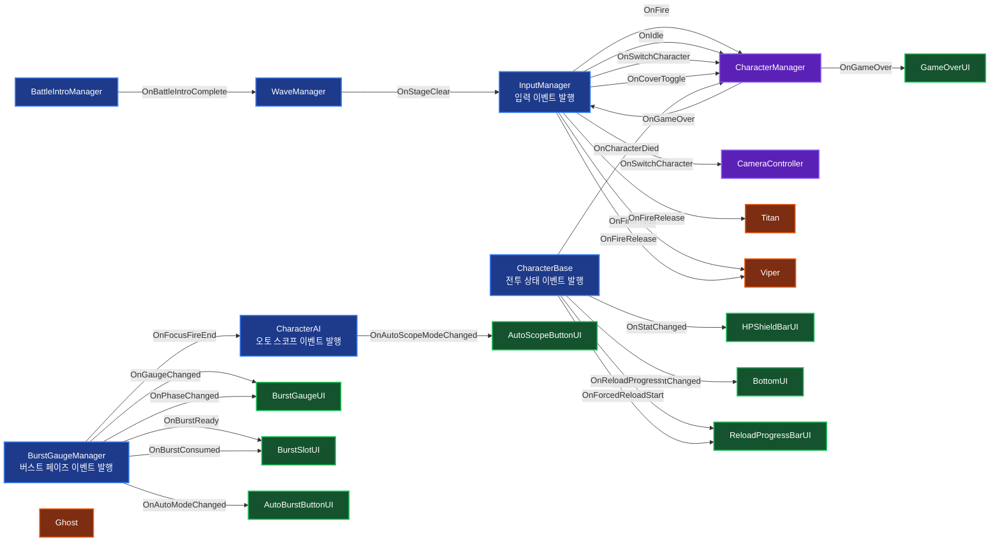

# Project BUSTER — NIKKE Combat System Reconstruction

> 시프트업의 건슈팅 RPG **Goddess of Victory: NIKKE** 의 전투 구조를 분석하고,
> 핵심 시스템을 직접 재설계·재구현한 1인 개발 포트폴리오 프로젝트.

---

## 1. 프로젝트 개요

| 항목 | 내용 |
|---|---|
| 프로젝트명 | Project BUSTER |
| 장르 | Mobile TPS / Cover Shooter (NIKKE-Like) |
| 개발 인원 | 1인 |
| 개발 기간 | 약 3개월 |
| 엔진 | Unity (URP) |
| 언어 | C# |
| 대상 플랫폼 | PC (Mobile 입력 추상화 구조 유지) |
| 개발 목적 | 상용 게임 전투 시스템의 분석·재구현을 통한 클라이언트 아키텍처 역량 증명 |

본 프로젝트는 "게임을 통째로 따라 만드는 것"이 아니라
**원작의 전투 메커닉을 분해·재해석·재구현**하는 데 초점을 두었습니다.

핵심 설계 축:

- State Machine 기반 캐릭터/적 전투 흐름
- Event-Driven 입력 추상화 (`InputManager` → 정적 이벤트)
- ObjectPool + IPoolable 인터페이스로 GC 최소화
- 추상 클래스 `CharacterBase` / `EnemyBase` 상속 구조
- Strategy 패턴 기반 적 타겟팅 (`ITargetStrategy`)
- 캐릭터 스위칭에 연동되는 카메라 Lerp 연출

---

## 2. 원작(NIKKE) 메커닉 재현 매트릭스

| 원작 메커닉 | 본 프로젝트 구현 | 일치도 |
|---|---|---|
| 엄폐 상태에서는 쉴드, 노출 상태에서는 HP가 깎임 | `CharacterBase.TakeDamage()` 가 `CharacterState`(Idle/Fire/Reload) 로 분기 | ★★★★★ |
| 1→2→3 버스트 단계 강제 + Full Burst | `BurstGaugeManager` 의 `BurstPhase` (Charging → Step1/2/3Ready → FocusFire) | ★★★★★ |
| 20초 안에 사용 안 하면 단계 리셋 | `StepReadyCoroutine(duration)` + `ResetToCharging()` | ★★★★★ |
| Full Burst 15초 지속 | `FocusFireCoroutine` (`focusFireDuration = 15f`) | ★★★★★ |
| 버스트 컷씬 동안 시간 정지 | `BurstSequence` 에서 `Time.timeScale = 0f` ↔ 1f 전환 | ★★★★☆ |
| 오토 버스트 (Auto) | Tab 키 `ToggleAutoMode()` + `AutoBurstCoroutine` (0.7초 후 자동 발동) | ★★★★★ |
| 오토 조준 (Auto Scope) | LeftShift 키 `CharacterAI.ToggleAutoScopeMode()` | ★★★★☆ |
| 캐릭터 무기별 발사 거동 (AR/MG/SR) | `Ghost` / `Titan` / `Viper` 각 무기별 `TryFire` 오버라이드 | ★★★★★ |
| 머신건 스핀업 연출 | `Titan.PlayFireSound()` — spinUp → loop 사운드 + fireRate Lerp | ★★★★★ |
| 차지샷 (런처/스나이퍼 계열) | `Viper.HandleFireRelease` — `chargeRatio` 로 데미지 1.5배 스케일 | ★★★★★ |
| 캐릭터 자동 리로딩 / 강제 풀 리로딩 | `TryReload` + `ForceCoverReload` + `coverReloadLocked` 잠금 | ★★★★★ |
| 적의 텔레그래프 공격 (경고 → 발사) | `EnemyA.LaserAttackRoutine` — 경고원(좁아짐) → 레이저 | ★★★★☆ |

> ★★★★★ : 거동·UX·내부 로직까지 원작과 거의 동일
> ★★★★☆ : 동작은 같으나 일부 디테일(애니메이션·이펙트) 보강 여지

---

## 3. 차별화 포인트 (원작과 다른 의도적 선택)

### 3-1. 캐릭터 위치 분산 + 카메라 Lerp 스위칭
원작은 5명의 니케가 화면 하단에 일렬로 고정되어 있지만,
본 프로젝트는 **3명의 캐릭터가 각자 다른 월드 위치를 가지며**,
스위칭 시 `CameraController.MoveToCharacter()` 가 해당 캐릭터로 카메라를 부드럽게 이동시킵니다.

### 3-2. 강제 엄폐 리로드 (Hold-Lock)
스페이스 입력 시 사격 중인 캐릭터도 강제로 리로드에 들어가도록 `coverReloadLocked = true` 잠금 처리.
**마우스를 누른 상태로 스페이스를 눌러도 리로드가 끊기지 않으며**, 리로드가 끝나면 자연스럽게 사격이 재개됩니다.

### 3-3. Plan B 사격 보정 (Viper 차지샷)
허공을 쐈을 때 시차 때문에 총알 궤적이 어색해지는 문제를
**적이 배치된 깊이 평면(`defaultEnemyZ = 20f`)에 가상 평면을 두고 Raycast 보정**으로 해결.

---

## 4. 캐릭터 스펙 (코드 기준 실측치)

| 캐릭터 | 버스트 | 무기 컨셉 | HP | 탄창 | 리로드 | 발사 데미지 | 버스트 충전량 | Bullet Speed | 특수 거동 |
|---|---|---|---|---|---|---|---|---|---|
| **Ghost** | 1버스트 | Assault Rifle | 100 | 120 | 1.0s | 20 | +5/발 | 500 | 단발 사격, 안정적 DPS |
| **Titan** | 2버스트 | Minigun | 200 | 400 | 1.5s | 10 | +10/발 | 500 | 스핀업 (5발 동안 발사속도 3→70 RPM 가속) |
| **Viper** | 3버스트 | Charged Shot | 100 | 5 | 1.0s | 50 | +20/발 | 800 | 차지 1.13초까지 1.5배 데미지 스케일 |

### 버스트 효과 (`UseBurst` 오버라이드)
- **Ghost (1버스트)** : 전체 적 2초 스턴 + 팀 HP 20% 회복 + FlashEffect
- **Titan (2버스트)** : 팀 전체 공격력 1.2배 (10초) + 별 이펙트 10초간 연속 자동 공격
- **Viper (3버스트)** : 현재 HP 최고 적에게 단발 20배 데미지 빔

---

## 5. 시스템 아키텍처

### 5-1. 디렉터리 구조
```
Assets/Scripts/
├── Core/                ← State 열거형 (전역 참조용 분리)
│   ├── CharacterState.cs
│   └── EnemyState.cs
├── Character/           ← CharacterBase 추상 + Ghost/Titan/Viper 구현
│   ├── CharacterBase.cs
│   ├── CharacterManager.cs
│   ├── CharacterAI.cs   ← 비활성 팀원 + 오토 스코프 통합 AI
│   ├── InputManager.cs
│   └── CrossHair/       ← 무기별 크로스헤어
├── Burst/               ← 3단계 버스트 시스템
│   └── BurstGaugeManager.cs
├── Combat/              ← BulletBase / EnemyBulletBase
├── Enemy/               ← EnemyBase 추상 + EnemyA/B/C + DamagePopup
├── Camera/              ← 캐릭터 스위칭 연동 카메라
├── Wave/                ← WaveManager + WaveData (난이도별 ScriptableObject)
├── UI/                  ← BurstSlot, ReloadProgress, GameOver 등
├── Utility/             ← ObjectPool, IPoolable, PoolObject
└── Scene/               ← LoadingSceneManager
```

### 5-2. 한 사이클 데이터 흐름
```
[Input] MouseDown
   ↓ InputManager.OnFire (event)
[CharacterManager] HandleFire()
   ↓ currentCharacter.TryFire()
[CharacterBase] 상태 = Fire, bulletCount--, FireBullet()
   ↓ bulletPool.Get() → BulletBase.Init(damage, speed, dir, chargingBurstGauge)
[BulletBase.Update] Raycast 충돌 예측 (이번 프레임 이동거리만큼)
   ↓ HandleCollision(hit.collider)
[EnemyBase] TakeDamage(damage) + DamagePopupManager.ShowDamage
   ↓ BurstGaugeManager.AddGauge(burstChargeAmount)
[BurstGaugeManager] currentGauge >= 500 → EnterPhase(Step1Ready)
   ↓ OnBurstReady event
[UI / BurstSlotsController] 슬롯 활성화
   ↓ 사용자 클릭 or AutoBurstCoroutine 0.7s 후 자동
[BurstGaugeManager.ExecuteBurst] target.UseBurst()
   ↓ Time.timeScale = 0 (컷씬)
[Character.UseBurst()] Ghost/Titan/Viper 각자의 효과
   ↓ EnterPhase(다음 단계 or FocusFire)
[FocusFire 15s] → ResetToCharging
```

### 5-3. 이벤트 토폴로지 (의존성 역전)

모든 시스템은 **정적 C# 이벤트** 로만 통신합니다. 발행자는 누가 구독하는지 모르고, 구독자는 발행자의 내부 구조를 모릅니다.



> **읽는 법:** 화살표는 "이벤트 발행 → 구독" 방향입니다. 예: `InputManager — OnFire →  CharacterManager` 는 InputManager 가 OnFire 를 발행하고 CharacterManager 가 구독한다는 의미.
>
> **고해상도 SVG 버전:** [`Assets/Docs/event-topology.svg`](Assets/Docs/event-topology.svg)

---

## 6. 핵심 코드 셀링 포인트

### 6-1. 상태 기반 피격 처리 — `CharacterBase.TakeDamage`
```csharp
switch(currentState)
{
    case CharacterState.Idle:   // 엄폐 → 쉴드 먼저, 깨지면 HP
        if(shield > 0) {
            shield -= damage;
            if(shield < 0) { hp += shield; shield = 0; }
        } else hp -= damage;
        break;
    case CharacterState.Fire:   // 노출 → 즉시 HP
        hp -= damage;
        break;
    case CharacterState.Reload: // 리로딩 = 엄폐 가정
        shield -= damage;
        if(shield < 0) { hp += shield; shield = 0; }
        break;
}
```
**설계 의도:** 원작에서 "엄폐 중이냐, 사격 중이냐"가 피격 결과를 결정하는 핵심이며, 이걸 코드 한 곳에서 일관되게 표현.

### 6-2. 동일 버프 중복 방지 — `CharacterBase.DamageBuffCoroutine`
```csharp
private Dictionary<string, Coroutine> activeBuffs = new();

private IEnumerator DamageBuffCoroutine(float multiplier, float duration, string buffId) {
    if (activeBuffs.ContainsKey(buffId) && activeBuffs[buffId] != null) {
        StopCoroutine(activeBuffs[buffId]);
        attackDamageMultiplier /= multiplier;   // 기존 효과 되돌리기
    }
    attackDamageMultiplier *= multiplier;       // 새 효과 적용 (재기동)
    activeBuffs[buffId] = StartCoroutine(BuffTimer(multiplier, duration, buffId));
    yield break;
}
```
**왜 중요한가:** Titan 버스트를 연속 발동했을 때 multiplier 가 누적되는 버그를 막아주며, ID 기반으로 N개의 독립 버프를 동시 관리 가능.

### 6-3. 단계 전환 시 코루틴 누수 방지 — `BurstGaugeManager`
```csharp
private void ExecuteBurst(CharacterBase target) {
    StopAllActiveCoroutines();
    OnBurstConsumed?.Invoke();
    BurstPhase capturedPhase = currentPhase;   // 코루틴 진행 중 phase 변경 방지
    StartCoroutine(BurstSequence(target, capturedPhase));
}

private void StopAllActiveCoroutines() {
    if (timerCoroutine != null) { StopCoroutine(timerCoroutine); timerCoroutine = null; }
    if (autoCoroutine  != null) { StopCoroutine(autoCoroutine);  autoCoroutine  = null; }
}
```
**왜 중요한가:** 단계 진입마다 이전 타이머/자동 발동 코루틴을 명시적으로 정리. capturedPhase 로 컷씬 도중 외부에서 phase 가 변경되어도 다음 단계 계산이 어긋나지 않음.

### 6-4. 고속 탄환 충돌 예측 — `BulletBase.Update`
```csharp
float moveDistance = speed * Time.deltaTime;
if (Physics.Raycast(transform.position, direction, out RaycastHit hit, moveDistance, collisionMask)) {
    transform.position = hit.point;
    HandleCollision(hit.collider);
    return;
}
transform.Translate(direction * moveDistance, Space.World);
```
**왜 중요한가:** Viper 의 `bulletSpeed = 800f` 처럼 빠른 탄환이 단순 Translate 시 콜라이더를 건너뛰는 문제(tunneling)를 방지. 이번 프레임에 이동할 거리만큼 Raycast 로 미리 충돌을 탐지.

### 6-5. Strategy 패턴 적 타겟팅 — `ITargetStrategy`
```csharp
public interface ITargetStrategy {
    CharacterBase GetTarget();
}
// 현재 구현: RandomTargetStrategy
// 확장 예정: LowestHpStrategy, NearestStrategy, ThreatBasedStrategy
```
**왜 중요한가:** 적 종류가 늘어도 `EnemyBase` 본체는 손대지 않고 전략만 갈아끼우면 됨.

---

## 7. 적 시스템

| 적 타입 | 행동 패턴 | 공격 메커닉 |
|---|---|---|
| **EnemyA** | 낙하 출현 → 고정 위치 → 일정 주기 공격 | 경고원(1.5초, 점점 좁아짐) → 레이저(0.5초) → 데미지 적용 |
| **EnemyB** | 화면 측면에서 진입 → 이동 후 공격 | 일반 사격 (구현 진행 중) |
| **EnemyC** | 근접 돌진형 | 플레이어 추적 |

공통 베이스 `EnemyBase`:
- 추상 메서드: `Initialize / Attack / Move / Jump`
- 공통 처리: `TakeDamage` (피격 플래시 + DamagePopup), `ApplyStun`, `Die` (콜라이더 비활성화 + 0.3초 지연 삭제)
- 출현 연출 보호: `isSpawning` 플래그로 출현 중에는 공격 불가
- 인트로 가드: `BattleStarted = false` 동안 전체 적 공격 차단

---

## 8. 입출력 시스템

### 8-1. 입력 (현재 PC 빌드 기준)
| 입력 | 동작 |
|---|---|
| Mouse Left (Press/Hold/Release) | 사격 / Viper 차지샷 |
| Space | 강제 엄폐 리로드 (Cover Toggle) |
| 1 / 2 / 3 | 캐릭터 스위칭 |
| Tab | Auto Burst 토글 |
| LeftShift | Auto Scope (자동 조준) 토글 |

> Unity Input System Actions(`InputSystem_Actions.inputactions`) 은 모바일 터치 입력 확장을 위해 유지 중. 현재 빌드는 `InputManager` 가 레거시 Input + 정적 이벤트로 추상화.

### 8-2. UI 연결
```
HPShieldBarUI       ← CharacterBase.OnStatChanged
BottomUI            ← OnBulletCountChanged / OnReloadProgress
ReloadProgressBarUI ← OnReloadProgress (음수 신호 = 취소)
BurstGaugeUI        ← BurstGaugeManager.OnGaugeChanged / OnPhaseChanged
BurstSlotUI         ← OnBurstReady / OnBurstConsumed
AutoBurstButtonUI   ← OnAutoModeChanged
AutoScopeButtonUI   ← CharacterAI.OnAutoScopeModeChanged
GameOverUI          ← CharacterManager.OnGameOver
BattleIntroUI       ← BattleIntroManager.OnBattleIntroComplete → WaveManager 가 BattleStarted 활성화
```

---

## 9. 최적화 전략

| 항목 | 적용 위치 | 효과 |
|---|---|---|
| Object Pooling | Bullet, EnemyBullet, DamagePopup | GC Spike 최소화 |
| Raycast 기반 충돌 예측 | BulletBase | 고속 탄환 tunneling 방지 + Trigger 호출 비용 절감 |
| 코루틴 명시적 종료 | BurstGaugeManager, CharacterBase.StopReload | 중복 코루틴 누적 방지 |
| 사운드 분리 (PlayOneShot vs Loop) | Titan 스핀업/루프 분리 | AudioSource 충돌 회피 |
| 활성 캐릭터만 사운드 재생 | `IsActiveCharacter` 가드 | 비조작 캐릭터의 발사음 누수 방지 |
| 적 위치 비겹침 배치 | WaveManager.GetNonOverlappingPosition | 최대 30회 시도, 겹침 방지 |

---

## 10. 개발 단계

| Phase | 목표 | 상태 |
|---|---|---|
| Phase 1 | 코어 전투 (사격/리로드/피격/스위칭) | ✅ 완료 |
| Phase 2 | 3단계 버스트 + 강제 엄폐 + 오토 시스템 | ✅ 완료 |
| Phase 3 | UI 연동 + 사운드 + 적 AI 패턴 다양화 | 🔄 진행 중 |
| Phase 4 | 보스 패턴 / Wave 밸런싱 / 모바일 빌드 | ⏳ 예정 |

---

## 11. 향후 개선 항목

- 보스 패턴 AI (다단계 페이즈 전환)
- StatusEffect 통합 구조 (`BuffEffect` / `DebuffEffect` / `DotEffect` 상속) — 현재는 `ApplyDamageBuff` 단독 구현, 일반화 예정
- ScriptableObject 기반 캐릭터/무기 데이터 외부화 (현재는 Initialize 하드코딩)
- Addressables 적용
- Mobile UI / 터치 입력 풀 활성화

---

## 12. 회고

본 프로젝트의 진짜 목표는 **"NIKKE 만큼의 게임을 만드는 것"이 아니라, NIKKE 의 전투 로직을 분해해서 다시 조립할 수 있는가**였습니다.

특히 다음 세 가지에 집중했습니다:

1. **시스템 간 의존성 최소화** — 입력/캐릭터/버스트/UI 가 정적 이벤트로만 통신하도록 분리
2. **상태에 따른 동작 분기를 한 곳에 모으기** — `CharacterState` / `BurstPhase` 가 모든 거동의 진입점
3. **확장 가능한 추상화** — 적 1종이 늘 때 `EnemyBase` 본체를 수정하지 않아도 되는 구조

---

## References
- Goddess of Victory: NIKKE (SHIFT UP)
- Unity Manual / URP Documentation
- Unity Input System Documentation
- Game Programming Patterns — State / Observer / Object Pool
